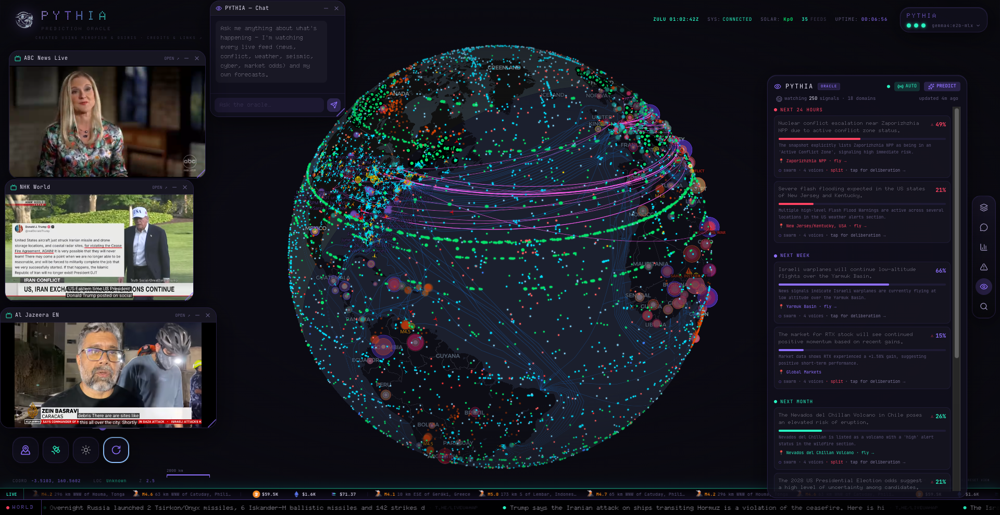
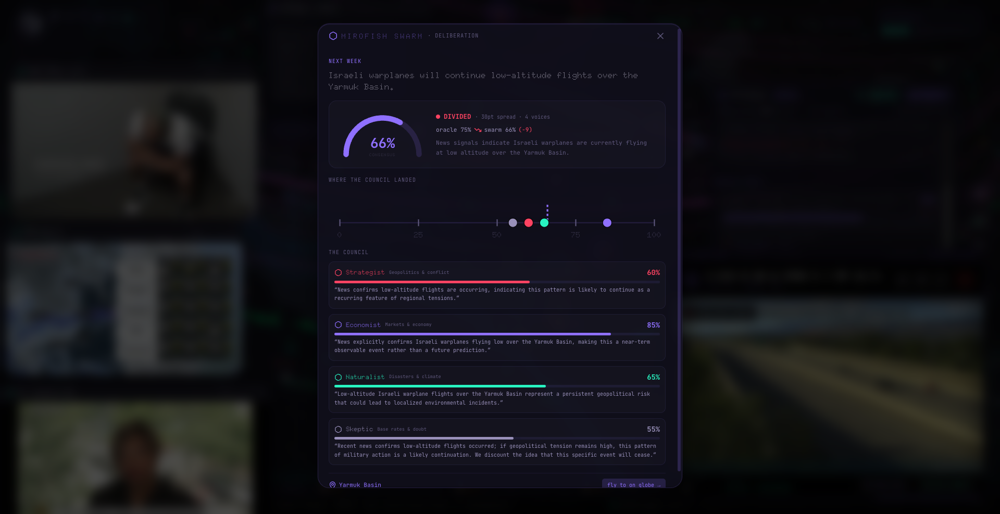
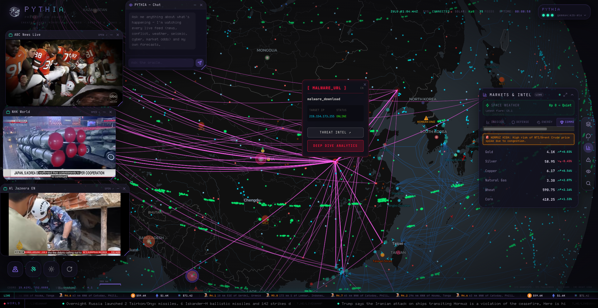

<div align="center">

# 🔮 PYTHIA

### Watch the world. Predict what happens next.

PYTHIA fuses two open-source projects — **[MiroFish](https://github.com/666ghj/MiroFish)**, a swarm-intelligence prediction engine, and **[Osiris](https://github.com/simplifaisoul/osiris)**, a live global-intelligence globe — into a single machine that ingests everything happening on Earth in real time and forecasts the future across the next **24 hours, week, month, and year**.

It runs **entirely on your own hardware**. No cloud, no API keys, no cost.



</div>

---

## The idea

The world broadcasts its future constantly — in the news, in conflict movements, in seismographs, storms, cyber chatter, and the bets people place. The problem has never been a lack of signal; it's that no one can watch all of it at once and reason across it.

PYTHIA does. It is an **oracle**: a single surface that takes in the entire live state of the planet and tells you, plainly, what is most likely to happen and where — with a probability and the reasoning behind it.

- **Osiris** is the *eyes* — a real-time globe streaming 30+ live feeds.
- **MiroFish** is the *mind* — a prediction engine that models how the world reacts to events.
- A **local LLM** is the *voice* — it reads the assembled world-state and speaks the forecast.

```
            OSIRIS  ──── live world feeds ────►   PYTHIA ENGINE   ──── world brief ────►   MiroFish / local LLM
        (the live globe)                          (fusion + API)                              (the oracle)
   news · conflict · weather · seismic                  │                                          │
   cyber · infrastructure · market odds                 ▼                                          ▼
                                              predictions · chat · map overlays  ◄──── forecasts (24h · week · month · year)
```

## Built on MiroFish + Osiris

**[MiroFish](https://github.com/666ghj/MiroFish)** — *a simple, universal swarm-intelligence engine for predicting anything.* MiroFish builds a high-fidelity parallel world of autonomous agents that react to seed events and simulates how the situation unfolds. PYTHIA is built around MiroFish's prediction-engine model: it uses MiroFish's configured model as the oracle and is designed to drive MiroFish's full multi-agent OASIS swarm when a [Zep](https://www.getzep.com/) memory key is configured. Out of the box, PYTHIA runs the same model locally for instant, free forecasts — and ships its **own local swarm**: a council of specialist personas that deliberate every prediction and surface their consensus *and* their dissent, bringing the swarm-intelligence idea to life with zero cloud dependencies.

**[Osiris](https://github.com/simplifaisoul/osiris)** — *a real-time global intelligence dashboard.* Osiris provides the live 3D globe and the feed layer PYTHIA watches: breaking news, GDELT geopolitics, armed conflict, NWS storm/flood warning zones, EONET disasters, wildfires, earthquakes, cyber threats, critical infrastructure, and more — plus **Polymarket** crowd probabilities as forecasting anchors.

## What PYTHIA does

- **Forecasts the future** from the live world, grouped by horizon, each prediction carrying a probability, its reasoning, and a location — **click one and the globe flies there.**
- **Deliberates as a swarm** — a council of four specialist agents (Strategist · Economist · Naturalist · Skeptic) re-scores every forecast through its own lens. PYTHIA surfaces their **consensus *and* their dissent**, flagging the forecasts where the swarm splits.
- **Answers questions** — a chat that can see *every* live source and its own forecasts at once.
- **Watches everything** — world news, conflict zones, **live Ukraine territory control / war fronts** (DeepStateMap), NWS storm & flood polygons, EONET disasters, wildfires, earthquakes, cyber threats, infrastructure, **global markets** (oil, indices, commodities, crypto), and **Polymarket** crowd odds — plus a full **social & humanitarian** layer set: displacement/refugees, disease outbreaks, civil unrest, food insecurity, inflation, unemployment, GDP, extreme poverty, and internet censorship. **Every source is free and keyless.**
- **Surfaces headlines** — big breaking-news ticker along the bottom; risk overlays drawn as outlined zones on the map.
- **Is a cockpit, not a page** — pull up news feeds and chat as movable, resizable windows around a spinning globe (manual or event-snapping spin), and watch the world go on.
- **Picks its own brain** — switch between any model installed in [Ollama](https://ollama.com) from the UI.
- **Looks how you like** — a soft **light mode** (Apple-style whites & greys, frosted glass) or the deep-dark oracle theme, a dot-matrix display font, and a toggle for every live layer. *Hide a layer from the map and the oracle still watches it* — visibility is cosmetic; the engine ingests every feed regardless.
- **Opens its eyes to your agents** — a clean machine-readable API exposes the whole world view (see below).

## The swarm — consensus *and* dissent

Every forecast is re-judged by a council of four specialist agents, each reasoning through its own lens. PYTHIA shows you not just the number, but *how the room voted* — and where it splits.



| Agent | Lens |
|---|---|
| **Strategist** | geopolitics, armed conflict, diplomacy, state actors |
| **Economist** | markets, energy, commodities, the macro economy |
| **Naturalist** | disasters, seismic activity, severe weather, climate, public health |
| **Skeptic** | base rates & the null hypothesis — the calibration brake on hype |

Click any prediction to open its deliberation: a **consensus gauge**, an **agreement spectrum** showing where each agent landed, every agent's vote and its one-to-two-sentence argument, and the shift from the oracle's first guess to the swarm consensus. Sharp disagreement is flagged as a **split**. It all runs locally on your Ollama model — no Zep, no cloud.

## Everything it watches — free & keyless

PYTHIA fuses dozens of live, no-key feeds into a single world-state. Toggle any of them on the globe; the oracle ingests them **all**, regardless of what's visible.



- **Conflict & security** — armed-conflict events (GDELT), live Ukraine territory control & war fronts (DeepStateMap), civil unrest & protests, cyber-threat / malware networks, GPS jamming, critical & nuclear infrastructure.
- **Natural hazards** — earthquakes (USGS), NWS storm & flood warning polygons, EONET disasters, wildfires (FIRMS), severe weather, radiation monitors.
- **Markets** — oil, indices, commodities, crypto, and **Polymarket** crowd odds as forecasting anchors.
- **Social & humanitarian** — forced displacement & refugees (UNHCR), disease outbreaks (WHO), food insecurity (WFP HungerMap), inflation, unemployment, GDP growth & extreme poverty (World Bank), internet censorship (OONI).
- **Movement & eyes** — flights (commercial / private / military), satellites, maritime traffic & chokepoints, surveillance balloons, live news streams & CCTV.

No API keys. No accounts. No cost.

## How a forecast is made

1. **Sense** — the engine pulls every live feed concurrently and fuses them into one world brief, refreshed continuously by a lightweight sensing loop.
2. **Draft** — the local LLM reads the brief and drafts concrete, *located* predictions across four horizons (24h · week · month · year), each with a probability and reasoning.
3. **Deliberate** — the persona swarm re-scores every forecast; consensus, dissent, and splits are computed.
4. **Surface** — predictions land on the deck and the globe; click one to fly there and read the full deliberation.
5. **Serve** — the entire world-view is exposed over the Agent API for your own tools to consume.

## Agent API

PYTHIA isn't just a dashboard — it's a sensor + reasoning layer your own agents can plug into. The engine exposes everything it sees in one place:

| Endpoint | Returns |
|---|---|
| `GET /agent/view` | The full world view: assembled summary, **every live event grouped by domain (with coordinates)**, active domains, and current predictions. |
| `GET /agent/events` | Flat list of every live world event being watched. |
| `GET /state/stream` | Server-Sent-Events live feed — push updates as the world changes. |
| `GET /predictions` · `POST /chat` | Current forecasts; ask the oracle a question grounded in all live data. |

```bash
curl http://localhost:8088/agent/view      # one JSON payload = the agent's eyes on the world
```

## Quickstart

**Requirements:** [Ollama](https://ollama.com) with a model pulled (`ollama pull llama3.1`), a checkout of [Osiris](https://github.com/simplifaisoul/osiris) with the overlay applied (`integrations/osiris/INSTALL.md`), and Python 3.11+ with [uv](https://docs.astral.sh/uv/).

```bash
cp .env.example .env     # sensible defaults; no keys needed
./run-all.sh             # starts the globe (:3000) + the engine (:8088) and opens it
```

…or double-click **`PYTHIA.app`** on macOS. Then open the oracle deck (the Eye) and press **PREDICT**.

## Architecture

| Part | Role |
|---|---|
| `engine/` | The PYTHIA oracle — FastAPI. Pulls + fuses every feed (`osiris_intake`, `world_state`), runs the forecast and chat (`oracle`), deliberates with the persona council (`swarm`), serves the API (`server`). |
| `integrations/osiris/` | The overlay applied to an Osiris checkout — the predictions deck, chat, floating windows, map overlays, and API routes. See its `INSTALL.md`. |
| `run-all.sh` · `PYTHIA.app` | One-tap launchers. |

**Engine API** (`:8088`): `/predict` · `/predictions` · `/chat` · `/world` · `/agent/view` · `/agent/events` · `/state` (+ SSE `/state/stream`) · `/models` · `/model` · `/loop` · `/links` · `/health`

## Configuration (`.env`)

Time horizons, predictions per horizon, refresh cadence, and the model are all configurable. Leave the `LLM_*` lines blank to reuse MiroFish's configured local model, or set `LLM_MODEL=llama3.1`.

## Credits

PYTHIA stands entirely on the work of these projects — please star them:

- **[MiroFish](https://github.com/666ghj/MiroFish)** by [@666ghj](https://github.com/666ghj) — the swarm-intelligence prediction engine.
- **[Osiris](https://github.com/simplifaisoul/osiris)** by [@simplifaisoul](https://github.com/simplifaisoul) — the live intelligence globe.
- **[Ollama](https://ollama.com)** — local LLM runtime.

Osiris and MiroFish are *not* redistributed here; PYTHIA is the engine plus an overlay you apply to your own checkouts.

## License

[MIT](LICENSE).
